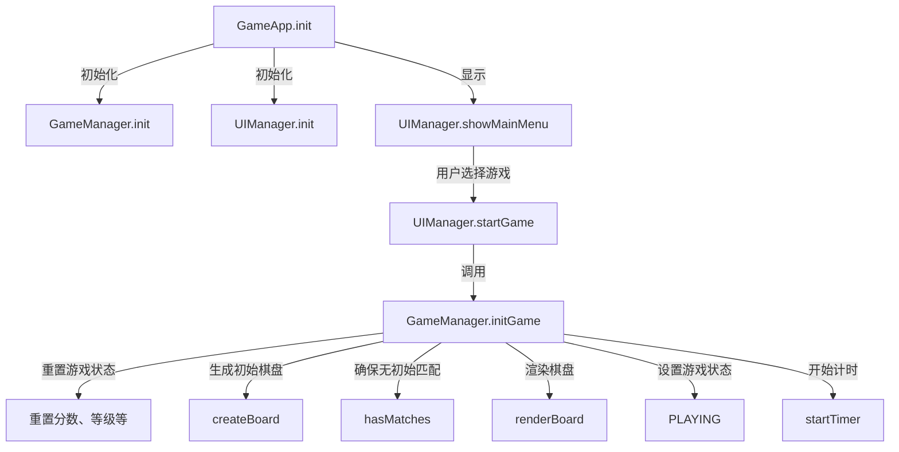
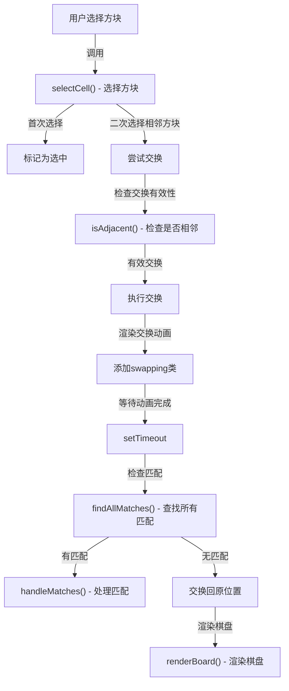
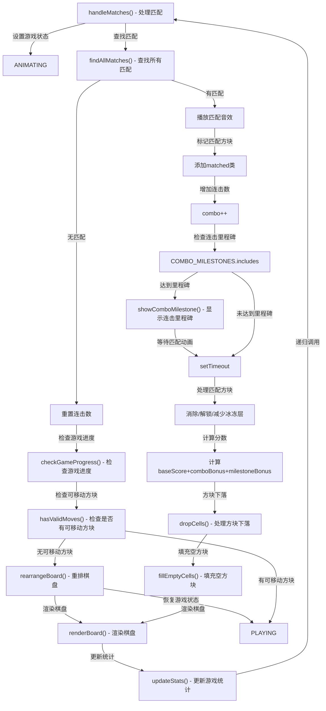
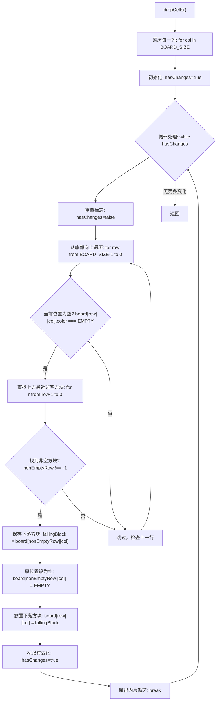
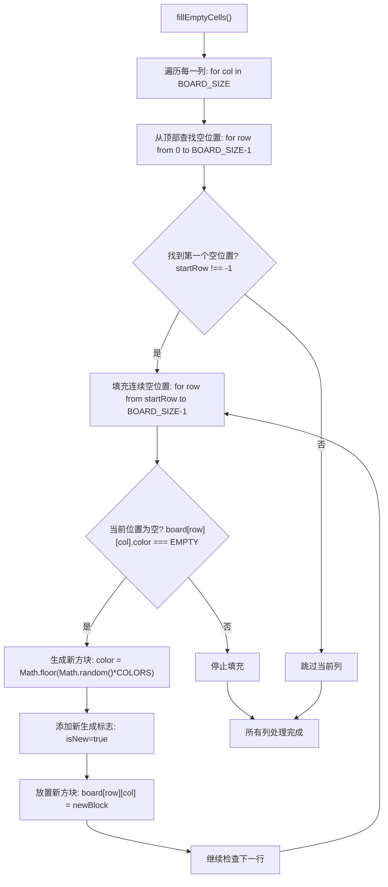
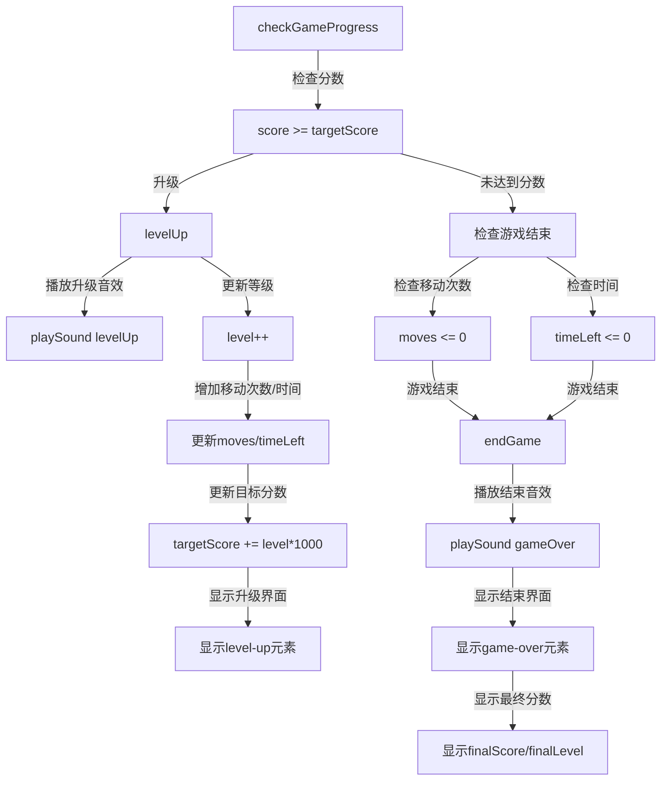
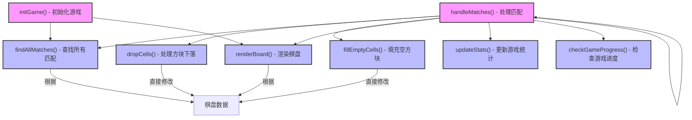

# 消消乐游戏函数逻辑关系图

## 1. 游戏初始化与开始流程

```mermaid
flowchart TD
    A[GameApp.init] -->|初始化| B[GameManager.init]
    A -->|初始化| C[UIManager.init]
    A -->|显示| D[UIManager.showMainMenu]
    D -->|用户选择游戏| E[UIManager.startGame]
    E -->|调用| F[GameManager.initGame]
    F -->|重置游戏状态| G[重置分数、等级等]
    F -->|生成初始棋盘| H[createBoard]
    F -->|确保无初始匹配| I[hasMatches]
    F -->|渲染棋盘| J[renderBoard]
    F -->|设置游戏状态| K[PLAYING]
    F -->|开始计时| L[startTimer]  
```

## 2. 游戏进行流程

```mermaid
flowchart TD
    M[用户选择方块] -->|调用| N["selectCell() - 选择方块"]
    N -->|首次选择| O[标记为选中]
    N -->|二次选择相邻方块| P[尝试交换]
    P -->|检查交换有效性| Q["isAdjacent() - 检查是否相邻"]
    Q -->|有效交换| R[执行交换]
    R -->|渲染交换动画| S[添加swapping类]
    S -->|等待动画完成| T[setTimeout]
    T -->|检查匹配| U["findAllMatches() - 查找所有匹配"]
    U -->|有匹配| V["handleMatches() - 处理匹配"]
    U -->|无匹配| W[交换回原位置]
    W -->|渲染棋盘| J["renderBoard() - 渲染棋盘"]
```

## 3. 匹配处理流程

```mermaid
flowchart TD
    V["handleMatches() - 处理匹配"] -->|设置游戏状态| X[ANIMATING]
    V -->|查找匹配| U["findAllMatches() - 查找所有匹配"]
    U -->|无匹配| Y[重置连击数]
    Y -->|检查游戏进度| Z["checkGameProgress() - 检查游戏进度"]
    Z -->|检查可移动方块| AA["hasValidMoves() - 检查是否有可移动方块"]
    AA -->|无可移动方块| AB["rearrangeBoard() - 重排棋盘"]
    AB -->|渲染棋盘| J["renderBoard() - 渲染棋盘"]
    AB -->|恢复游戏状态| AC[PLAYING]
    AA -->|有可移动方块| AC[PLAYING]
    U -->|有匹配| AD[播放匹配音效]
    AD -->|标记匹配方块| AE[添加matched类]
    AE -->|增加连击数| AF[combo++]
    AF -->|检查连击里程碑| AG[COMBO_MILESTONES.includes]
    AG -->|达到里程碑| AH["showComboMilestone() - 显示连击里程碑"]
    AH -->|等待匹配动画| AI[setTimeout]
    AG -->|未达到里程碑| AI[setTimeout]
    AI -->|处理匹配方块| AJ[消除/解锁/减少冰冻层]
    AJ -->|计算分数| AK[计算baseScore+comboBonus+milestoneBonus]
    AK -->|方块下落| AL["dropCells() - 处理方块下落"]
    AL -->|填充空方块| AM["fillEmptyCells() - 填充空方块"]
    AM -->|渲染棋盘| J["renderBoard() - 渲染棋盘"]
    J -->|更新统计| AN["updateStats() - 更新游戏统计"]
    AN -->|递归调用| V["handleMatches() - 处理匹配"]
```

## 4. 方块下落流程

```mermaid
flowchart TD
    AL["dropCells()"] --> AO["遍历每一列: for col in BOARD_SIZE"]
    AO --> AP["初始化: hasChanges=true"]
    AP --> AQ{"循环处理: while hasChanges"}
    AQ --> AR["重置标志: hasChanges=false"]
    AR --> AS["从底部向上遍历: for row from BOARD_SIZE-1 to 0"]
    AS --> AT{"当前位置为空? board[row][col].color === EMPTY"}
    AT -->|是| AU["查找上方最近非空方块: for r from row-1 to 0"]
    AT -->|否| BB["跳过，检查上一行"]
    AU --> AV{"找到非空方块? nonEmptyRow !== -1"}
    AV -->|是| AW["保存下落方块: fallingBlock = board[nonEmptyRow][col]"]
    AV -->|否| BB
    AW --> AX["原位置设为空: board[nonEmptyRow][col] = EMPTY"]
    AX --> AY["放置下落方块: board[row][col] = fallingBlock"]
    AY --> AZ["标记有变化: hasChanges=true"]
    AZ --> BA["跳出内层循环: break"]
    BA --> AQ
    BB --> AS
    AQ -->|无更多变化| BC["返回"]
```

## 5. 填充空方块流程

```mermaid
flowchart TD
    AM["fillEmptyCells()"] --> BD["遍历每一列: for col in BOARD_SIZE"]
    BD --> BE["从顶部查找空位置: for row from 0 to BOARD_SIZE-1"]
    BE --> BF{"找到第一个空位置? startRow !== -1"}
    BF -->|是| BG["填充连续空位置: for row from startRow to BOARD_SIZE-1"]
    BF -->|否| BN["跳过当前列"]
    BG --> BH{"当前位置为空? board[row][col].color === EMPTY"}
    BH -->|是| BI["生成新方块: color = Math.floor(Math.random()*COLORS)"]
    BH -->|否| BM["停止填充"]
    BI --> BJ["添加新生成标志: isNew=true"]
    BJ --> BK["放置新方块: board[row][col] = newBlock"]
    BK --> BL["继续检查下一行"]
    BL --> BG
    BM --> BO["所有列处理完成"]
    BN --> BO
```

## 6. 游戏结束流程

```mermaid
flowchart TD
    Z[checkGameProgress] -->|检查分数| BP[score >= targetScore]
    BP -->|升级| BQ[levelUp]
    BQ -->|播放升级音效| BR[playSound levelUp]
    BQ -->|更新等级| BS[level++]
    BS -->|增加移动次数/时间| BT[更新moves/timeLeft]
    BT -->|更新目标分数| BU[targetScore += level*1000]
    BU -->|显示升级界面| BV[显示level-up元素]
    BP -->|未达到分数| BW[检查游戏结束]
    BW -->|检查移动次数| BX[moves <= 0]
    BW -->|检查时间| BY[timeLeft <= 0]
    BX -->|游戏结束| BZ[endGame]
    BY -->|游戏结束| BZ[endGame]
    BZ -->|播放结束音效| CA[playSound gameOver]
    CA -->|显示结束界面| CB[显示game-over元素]
    CB -->|显示最终分数| CC[显示finalScore/finalLevel]
```

## 7. 核心函数调用关系图

```mermaid
flowchart TD
    classDef mainFunc fill:#f9f,stroke:#333,stroke-width:2px;
    classDef helperFunc fill:#bbf,stroke:#333,stroke-width:2px;
    
    initGame["initGame() - 初始化游戏"]:::mainFunc
    handleMatches["handleMatches() - 处理匹配"]:::mainFunc
    findAllMatches["findAllMatches() - 查找所有匹配"]:::helperFunc
    dropCells["dropCells() - 处理方块下落"]:::helperFunc
    fillEmptyCells["fillEmptyCells() - 填充空方块"]:::helperFunc
    renderBoard["renderBoard() - 渲染棋盘"]:::helperFunc
    updateStats["updateStats() - 更新游戏统计"]:::helperFunc
    checkGameProgress["checkGameProgress() - 检查游戏进度"]:::helperFunc
    board["棋盘数据"]
    
    initGame --> findAllMatches
    initGame --> renderBoard
    
    handleMatches --> findAllMatches
    handleMatches --> dropCells
    handleMatches --> fillEmptyCells
    handleMatches --> renderBoard
    handleMatches --> updateStats
    handleMatches --> checkGameProgress
    handleMatches --> handleMatches
    
    dropCells -->|直接修改| board
    fillEmptyCells -->|直接修改| board
    renderBoard -->|根据| board
    findAllMatches -->|根据| board
```