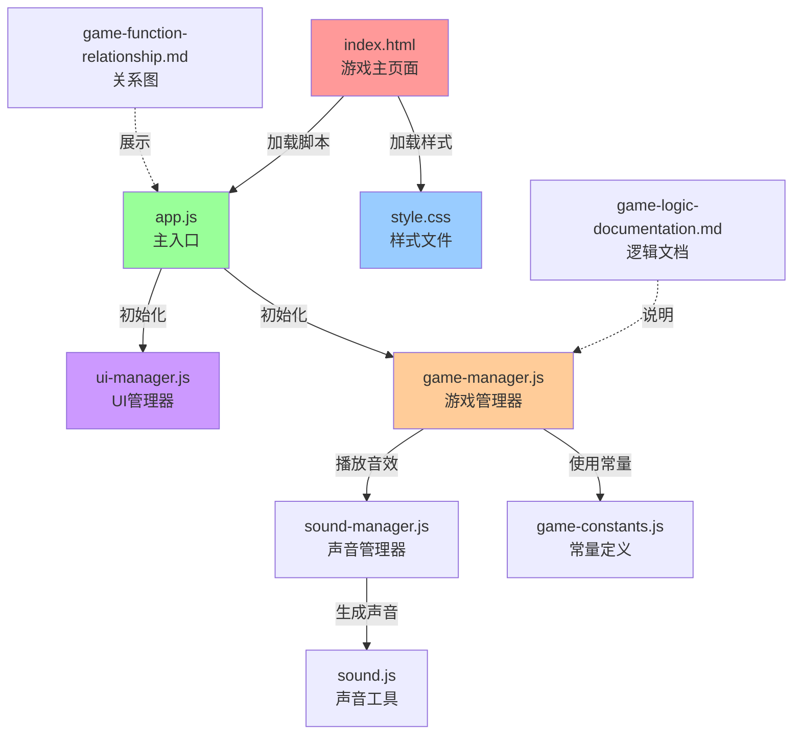

# 消消乐游戏项目结构说明

## 📁 目录结构图

```
test-xiaoxiaole-GLM4.7/          ← 项目根目录
│
├── 📄 index.html                ← 游戏的主页面（网页入口）
│
├── 📁 css/                      ← 样式文件夹（存放CSS样式）
│   └── 📄 style.css            ← 游戏的所有样式（颜色、布局、动画等）
│
├── 📁 js/                       ← JavaScript文件夹（存放游戏代码）
│   ├── 📄 app.js               ← 游戏的主入口文件
│   │
│   ├── 📁 audio/               ← 音频管理文件夹
│   │   └── 📄 sound-manager.js ← 声音管理器（管理游戏音效）
│   │
│   ├── 📁 game/                ← 游戏逻辑文件夹
│   │   ├── 📄 game-constants.js ← 游戏常量定义（颜色、模式等）
│   │   └── 📄 game-manager.js  ← 游戏管理器（核心游戏逻辑）
│   │
│   ├── 📁 ui/                  ← 用户界面文件夹
│   │   └── 📄 ui-manager.js    ← UI管理器（管理菜单、按钮等）
│   │
│   └── 📁 utils/               ← 工具函数文件夹
│       └── 📄 sound.js         ← 声音工具函数（生成音效）
│
├── 📄 game-logic-documentation.md  ← 游戏逻辑说明文档
├── 📄 game-function-relationship.md ← 函数关系图文档
│
└── 📁 .trae/                    ← IDE配置文件夹（自动生成）
    └── 📁 documents/           ← 文档文件夹
        ├── 📄 消消乐游戏改进计划.md
        └── 📄 消消乐游戏改进计划 (1).md
```

---

## 📖 详细文件说明

### 🎯 核心文件（游戏必须的）

#### 1. index.html - 游戏的主页面

**作用**：游戏的"门面"，用户看到的网页

**内容**：
- 游戏标题
- 主菜单按钮（经典模式、限时模式、无尽模式等）
- 游戏棋盘（8x8的方块网格）
- 分数、等级、剩余步数显示
- 设置菜单、帮助菜单

**比喻**：就像房子的门和窗户，用户从这里进入游戏

**关键代码**：
```html
<!DOCTYPE html>
<html lang="zh-CN">
<head>
    <meta charset="UTF-8">
    <title>消消乐游戏</title>
    <link rel="stylesheet" href="css/style.css">
</head>
<body>
    <!-- 主菜单 -->
    <div id="main-menu" class="main-menu">
        <h1 class="game-title">消消乐</h1>
        <!-- 游戏模式按钮 -->
    </div>
    
    <!-- 游戏界面 -->
    <div id="game-container" class="game-container">
        <div id="board" class="board"></div>
    </div>
    
    <script type="module" src="js/app.js"></script>
</body>
</html>
```

---

#### 2. css/style.css - 游戏的"化妆师"

**作用**：控制游戏的外观和样式

**内容**：
- 方块的颜色和形状（圆形、圆角矩形）
- 按钮的样式（大小、颜色、悬停效果）
- 动画效果（消除、移动、交换）
- 页面布局（Flexbox、Grid布局）
- 响应式设计（适配不同屏幕尺寸）

**比喻**：就像装修师，决定游戏长什么样

**主要样式类**：
- `.board` - 游戏棋盘容器
- `.cell` - 单个方块
- `.menu-btn` - 菜单按钮
- `.game-title` - 游戏标题

---

#### 3. js/app.js - 游戏的"总指挥"

**作用**：游戏的主入口，负责启动游戏

**内容**：
- 初始化游戏管理器（GameManager）
- 初始化UI管理器（UIManager）
- 协调各个模块之间的交互
- 等待DOM加载完成后启动游戏

**比喻**：就像公司的CEO，指挥各个部门工作

**代码结构**：
```javascript
import GameManager from './game/game-manager.js';
import UIManager from './ui/ui-manager.js';

class GameApp {
    constructor() {
        this.gameManager = new GameManager();
        this.uiManager = new UIManager();
    }
    
    init() {
        // 初始化游戏管理器
        this.gameManager.init(domElements);
        // 初始化UI管理器
        this.uiManager.init(this.gameManager);
        // 显示主菜单
        this.uiManager.showMainMenu();
    }
}

const gameApp = new GameApp();
gameApp.init();
```

---

### 🎮 游戏逻辑文件夹（js/game/）

#### 4. js/game/game-manager.js - 游戏的"大脑"

**作用**：管理游戏的核心逻辑

**内容**：
- 棋盘管理（创建、更新、渲染）
- 匹配检测（找出3个或更多相同的方块）
- 方块移动和消除
- 分数计算和等级提升
- 游戏状态管理（空闲、进行中、暂停、结束）
- 特殊方块生成（炸弹、彩虹、行列消除）
- 连击系统

**比喻**：就像游戏的大脑，处理所有游戏规则

**主要方法**：
- `createBoard()` - 创建初始棋盘
- `renderBoard()` - 渲染棋盘
- `selectCell(row, col)` - 选择方块
- `swapCells(cell1, cell2)` - 交换两个方块
- `findMatches()` - 查找匹配
- `eliminateMatches(matches)` - 消除匹配的方块
- `calculateAndAddScore()` - 计算并添加分数
- `levelUp()` - 升级

---

#### 5. js/game/game-constants.js - 游戏的"字典"

**作用**：定义游戏中的常量

**内容**：
- 方块颜色定义（红色、橙色、黄色、绿色、蓝色、紫色）
- 游戏模式（经典、限时、无尽、解谜、连锁风暴、特殊方块挑战、重力反转）
- 特殊方块类型（无、行消除、列消除、炸弹、彩虹）
- 道具类型（重排、提示、特殊方块生成、时间冻结）
- 连击里程碑
- 难度设置

**比喻**：就像字典，定义了游戏中的各种"词汇"

**主要常量**：
```javascript
export const COLORS = {
    RED: '#FF6B6B',
    ORANGE: '#FFA500',
    YELLOW: '#FFD93D',
    GREEN: '#6BCB77',
    BLUE: '#4D96FF',
    PURPLE: '#9B59B6'
};

export const GAME_MODES = {
    CLASSIC: 'classic',
    TIME: 'time',
    ENDLESS: 'endless',
    PUZZLE: 'puzzle',
    CHAIN_STORM: 'chain_storm',
    SPECIAL_CHALLENGE: 'special_challenge',
    GRAVITY_FLIP: 'gravity_flip'
};
```

---

### 🎨 用户界面文件夹（js/ui/）

#### 6. js/ui/ui-manager.js - 游戏的"前台"

**作用**：管理用户界面和交互

**内容**：
- 显示/隐藏主菜单
- 显示/隐藏游戏界面
- 显示/隐藏设置菜单
- 显示/隐藏帮助菜单
- 处理按钮点击事件
- 更新分数、等级、剩余步数显示
- 显示游戏结束界面
- 处理触控事件

**比喻**：就像餐厅的服务员，负责接待顾客和处理点单

**主要方法**：
- `showMainMenu()` - 显示主菜单
- `startGame(mode)` - 开始游戏
- `showSettings()` - 显示设置菜单
- `showHelp()` - 显示帮助菜单
- `updateStats()` - 更新游戏统计信息
- `showGameOver()` - 显示游戏结束界面

---

### 🔊 音频文件夹（js/audio/ 和 js/utils/）

#### 7. js/audio/sound-manager.js - 声音的"指挥官"

**作用**：管理游戏音效

**内容**：
- 开启/关闭音效
- 播放不同音效（消除、交换、游戏结束、升级等）
- 管理音效音量

**比喻**：就像音乐指挥，决定什么时候播放什么声音

**主要方法**：
- `toggleSound()` - 切换音效开关
- `playEliminateSound()` - 播放消除音效
- `playSwapSound()` - 播放交换音效
- `playGameOverSound()` - 播放游戏结束音效
- `playLevelUpSound()` - 播放升级音效

---

#### 8. js/utils/sound.js - 声音的"生成器"

**作用**：生成游戏音效

**内容**：
- 使用Web Audio API生成声音
- 创建不同频率和音调的音效
- 生成正弦波、方波等波形

**比喻**：就像乐器，负责制造各种声音

**主要函数**：
```javascript
export function playSound(frequency, duration, type = 'sine') {
    const audioContext = new (window.AudioContext || window.webkitAudioContext)();
    const oscillator = audioContext.createOscillator();
    const gainNode = audioContext.createGain();
    
    oscillator.type = type;
    oscillator.frequency.setValueAtTime(frequency, audioContext.currentTime);
    
    gainNode.gain.setValueAtTime(0.3, audioContext.currentTime);
    gainNode.gain.exponentialRampToValueAtTime(0.01, audioContext.currentTime + duration);
    
    oscillator.connect(gainNode);
    gainNode.connect(audioContext.destination);
    
    oscillator.start();
    oscillator.stop(audioContext.currentTime + duration);
}
```

---

### 📚 文档文件

#### 9. game-logic-documentation.md - 游戏逻辑说明书

**作用**：详细说明游戏如何运行

**内容**：
- 游戏概述
- 核心组件说明
- 游戏流程说明
- 游戏模式说明
- 特殊方块说明
- 道具系统说明

**比喻**：就像产品的使用说明书

---

#### 10. game-function-relationship.md - 函数关系图

**作用**：展示各个函数之间的关系

**内容**：
- 游戏初始化流程图
- 游戏进行流程图
- 匹配检测流程图
- 消除流程图
- 函数调用关系

**比喻**：就像城市的交通地图，显示各个地方怎么连接

---

### ⚙️ 配置文件夹（.trae/）

#### 11. .trae/ - IDE配置文件夹

**作用**：IDE（集成开发环境）的配置

**内容**：
- 文档记录
- 项目设置
- 开发历史

**注意**：这个文件夹是IDE自动生成的，通常不需要手动修改

**比喻**：就像电脑的系统文件夹，用户一般不用管它

---

## 🔄 文件之间的关系图



---

## 📝 总结表

| 文件/文件夹 | 作用 | 重要程度 | 修改频率 |
|------------|------|---------|---------|
| **index.html** | 游戏主页面 | ⭐⭐⭐⭐⭐ | 低 |
| **css/style.css** | 游戏样式 | ⭐⭐⭐⭐⭐ | 中 |
| **js/app.js** | 游戏入口 | ⭐⭐⭐⭐⭐ | 低 |
| **js/game/game-manager.js** | 游戏逻辑 | ⭐⭐⭐⭐⭐ | 高 |
| **js/game/game-constants.js** | 游戏常量 | ⭐⭐⭐⭐ | 中 |
| **js/ui/ui-manager.js** | UI管理 | ⭐⭐⭐⭐⭐ | 中 |
| **js/audio/sound-manager.js** | 声音管理 | ⭐⭐⭐ | 低 |
| **js/utils/sound.js** | 声音生成 | ⭐⭐⭐ | 低 |
| **game-logic-documentation.md** | 逻辑文档 | ⭐⭐ | 低 |
| **game-function-relationship.md** | 关系图 | ⭐⭐ | 低 |
| **.trae/** | IDE配置 | ⭐ | 不需要 |

---

## 💡 给初学者的建议

### 1. 从哪里开始学习？

1. **第一步**：打开 `index.html`，看看游戏长什么样
2. **第二步**：阅读 `game-logic-documentation.md`，了解游戏如何运行
3. **第三步**：查看 `js/app.js`，理解游戏如何启动
4. **第四步**：学习 `js/game/game-manager.js`，掌握核心逻辑
5. **第五步**：修改 `css/style.css`，试着改改颜色和样式

### 2. 如何运行游戏？

**重要**：必须使用HTTP服务器，不能直接双击HTML文件！

```bash
# 在项目根目录下运行
python -m http.server 8000

# 然后在浏览器访问
http://localhost:8000
```

### 3. 理解模块化

每个文件负责一个功能：
- `game-manager.js` - 负责游戏规则
- `ui-manager.js` - 负责界面显示
- `sound-manager.js` - 负责声音播放
- `game-constants.js` - 负责常量定义

这样代码更清晰，更容易维护！

### 4. 常见问题

**Q: 为什么直接打开HTML文件会报错？**

A: 因为项目使用了ES模块，浏览器禁止通过 `file://` 协议加载ES模块。必须使用HTTP服务器。

**Q: 如何修改游戏难度？**

A: 修改 `js/game/game-constants.js` 中的 `DIFFICULTY` 常量。

**Q: 如何添加新的游戏模式？**

A: 在 `game-constants.js` 中添加新模式，然后在 `game-manager.js` 中实现相应逻辑。

---

## 🎯 项目特点

1. **模块化设计**：代码结构清晰，易于维护和扩展
2. **多种游戏模式**：经典、限时、无尽、解谜、连锁风暴、特殊方块挑战、重力反转
3. **特殊方块系统**：炸弹、彩虹、行列消除等
4. **道具系统**：重排、提示、特殊方块生成、时间冻结
5. **连击系统**：连续消除获得额外分数
6. **音效系统**：使用Web Audio API生成音效
7. **响应式设计**：适配不同屏幕尺寸
8. **触控支持**：支持手机和平板操作

---

## 📚 相关文档

- [游戏逻辑说明文档](./game-logic-documentation.md)
- [函数关系图](./game-function-relationship.md)
- [消消乐游戏改进计划](./.trae/documents/消消乐游戏改进计划.md)

---

**祝你学习愉快！** 🎮✨
